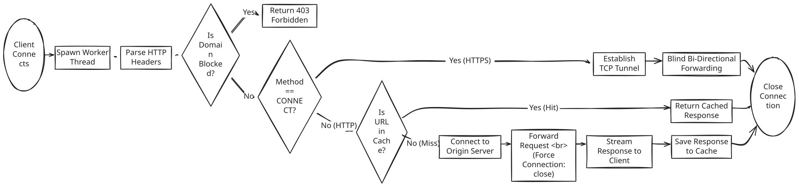

# Multi-Threaded HTTP/HTTPS Proxy Server with Caching

---

## Project Overview

This project is a **high-performance, multi-threaded HTTP/HTTPS proxy server** implemented in **C++**.  
It acts as an intermediary between clients and web servers, forwarding requests, enforcing access rules, and optimizing performance through caching.

The proxy uses a **Thread-per-Connection** concurrency model to handle multiple clients simultaneously and supports both **HTTP forwarding** and **HTTPS tunneling (CONNECT method)**.

---

## Demo Video: **[Watch Full Demo Video](https://www.youtube.com/watch?v=ggeBOGcsDJc)**

---

## Features Implemented

- **Concurrency**
  - Handles multiple clients simultaneously using POSIX threads (`pthread`).

- **HTTP Forwarding**
  - Parses client HTTP requests and relays them to destination servers.

- **HTTPS Tunneling**
  - Supports the `CONNECT` method for secure SSL/TLS tunneling.

- **Caching System**
  - Thread-safe, in-memory **LRU-style cache** to speed up repeated requests.

- **Traffic Filtering**
  - Blocks access to blacklisted domains defined in `config/blocked_domains.txt`.

- **Logging**
  - Real-time logging of timestamps, client IPs, request type, cache hits/misses, and blocked requests.

---

## 📂 Project Structure

```text
proxy_project/
├── src/
│   └── proxy.cpp            # Main proxy server implementation
├── config/
│   ├── blocked_domains.txt  # List of blocked domains
│   └── server.conf          # Server configuration documentation
├── docs/
│   ├── DESIGN.md            # Architecture & concurrency design
│   ├── DEMO.md              # Demonstration commands
│   └── flow_diagram.png     # (Optional) Visual logic flow
├── tests/
│   ├── test_proxy.sh        # Automated test script
│   └── sample_logs.txt      # Sample execution logs
├── Makefile                 # Build automation
└── README.md                # Project documentation
```

---

## Build & Run
1️. Build the Project:
Use the provided Makefile to compile the proxy server:
make clean && make

2️. Start the Server:
Run the compiled binary.
By default, the proxy listens on port 8080.
./proxy_server

---

## Usage & Testing

Open a new terminal and use curl to test the proxy functionality.

### 1️. Standard HTTP (Cache Miss & Cache Hit)
- First request (downloads from web → CACHE_MISS)
curl -x localhost:8080 http://example.com

- Second request (served from memory → CACHE_HIT)
curl -x localhost:8080 http://example.com

### 2️. HTTPS Tunneling (Secure)
- Secure connection via CONNECT tunnel
curl -x localhost:8080 https://google.com

### 3️. Domain Blocking
- Attempt to access a blocked domain
curl -x localhost:8080 http://badsite.com

---

## Workflow Diagram
<p align="center">
  
</p>
